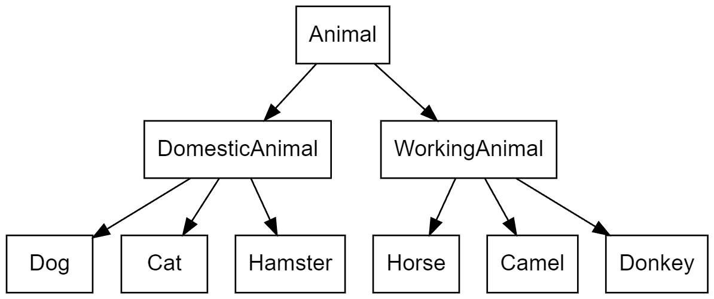
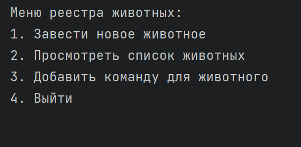

# Итоговая работа по блоку специализация

<a href="files/test_task.pdf" target="_blank">Текст задания</a>

# Ход выполнения

## Linux

### Задание 1 
Используя команду cat в терминале операционной системы Linux, создать два файла Домашние животные (заполнив файл собаками, кошками, хомяками) и Вьючные животными заполнив файл Лошадьми, верблюдами и ослы), а затем объединить их. Просмотреть содержимое созданного файла. Переименовать файл, дав ему новое имя (Друзья человека).

```
cat > "Домашние животные" <<EOF
Собаки
Кошки
Хомяки
EOF

cat > "Вьючные животные" <<EOF
Лошади
Верблюды
Ослы
EOF

cat "Домашние животные" "Вьючные животные" > "Животные"

mv "Животные" "Друзья человека"
```


### Задание 2

Создать директорию, переместить файл туда. 
```
mkdir "Мои животные"

mv "Друзья человека" "Мои животные/"
```


### Задание 3 

Подключить дополнительный репозиторий MySQL. Установить любой пакет из этого репозитория.
```
sudo wget -c https://dev.mysql.com/get/mysql-apt-config_0.8.24-1_all.deb
sudo dpkg -i mysql-apt-config_0.8.24-1_all.deb
```


### Задание 4

Установить и удалить deb-пакет с помощью dpkg. 
```
sudo dpkg -r mysql-server-8.0
```

### Задание 5

Выложить историю команд в терминале ubuntu
```
history
```


### Задание 6 

Нарисовать диаграмму, в которой есть класс родительский класс, домашние
животные и вьючные животные, в составы которых в случае домашних
животных войдут классы: собаки, кошки, хомяки, а в класс вьючные животные
войдут: Лошади, верблюды и ослы).

<a href="images/diag.png" target="_blank">**Простая диаграмма:**</a>



<a href="images/class_diag.png" target="_blank">**Диаграмма классов:**</a>


## SQL

### Задание 7

В подключенном MySQL репозитории создать базу данных “Друзья
человека”

```
sudo mysql
CREATE DATABASE FriendsOfHumans;
```


### Задания 8 - 12

Задания с 8 по 12 представлены в отдельном <b><a href="files/sql_tasks_8-12.sql" target="_blank" style="font-size: 20px;">SQL файле</a></b>


## Java

### Задачи 13 - 15

13.	Создать класс с Инкапсуляцией методов и наследованием по диаграмме.
14.	Написать программу, имитирующую работу реестра домашних животных.
    * Завести новое животное
    * Определять животное в правильный класс
    * Увидеть список команд, которое выполняет животное
    * Обучить животное новым командам
    * Реализовать навигацию по меню
15.	Создайте класс Счетчик, у которого есть метод add(), увеличивающий̆ значение внутренней̆ int переменной̆ на 1 при нажатие “Завести новое животное” Сделайте так, чтобы с объектом такого типа можно было работать в блоке try-with-resources. Нужно бросить исключение, если работа с объектом типа счетчик была не в ресурсном try и/или ресурс остался открыт. Значение считать в ресурсе try, если при заведении животного заполнены все поля.

<b><a href="https://github.com/AntonkinAnton/SpecTest/tree/main/AnimalReg/src" target="_blank" style="font-size: 20px;">Папка проекта</a></b>

Программа на Java представляет собой реестр домашних животных, который позволяет пользователю добавлять новых животных разных классов (например, собак, кошек, хомяков, лошадей, верблюдов, ослов), присваивать им имена, возраст и породу, а также добавлять команды, которые они выполняют.

Основные функции программы:

* Добавление нового животного: Пользователь может добавлять новых животных, указывая их класс (например, собака, кошка) и характеристики (имя, возраст, порода).

* Добавление команд: Пользователь может добавлять команды для каждого животного.

* Просмотр списка животных: Пользователь может просматривать список всех животных, разделенных по классам.

* Просмотр списка команд: Пользователь может просматривать список команд для каждого животного.

* Управление через интерактивное меню: Программа предоставляет меню с выбором действий, которые пользователь может выполнять.

* Использование наследования и полиморфизма: Программа использует наследование для организации классов животных и полиморфизм для работы с ними.

Программа создана на языке Java и включает в себя классы для различных типов животных, а также класс AnimalRegistry, который управляет списками животных и командами. Программа предоставляет удобный интерфейс для добавления, просмотра и управления данными о животных и их командах.

## Скриншоты работающей программы

Скриншоты выполнения




